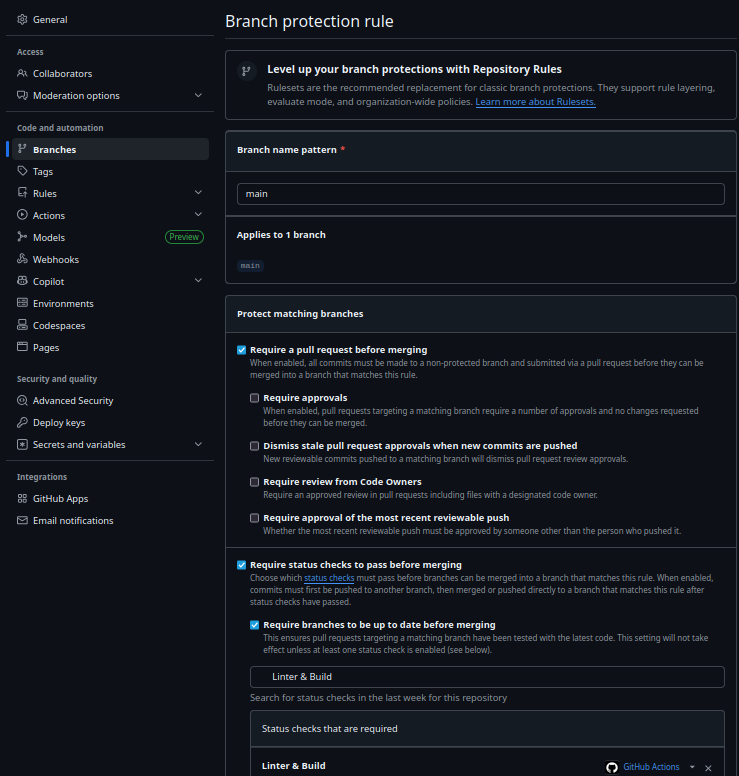

# Projeto Individual: Currículo Online DS881

Link para o GitHub Pages: https://caixodarksixo.github.io/ds881-curriculo-GRR20243792/

## Instruções para execução via docker

1. Ter o Docker instalado.
2. Clonar o repositório.
3. No terminal da pasta onde o repositório foi clonado, rodar `sudo docker compose up --build`
4. Abrir o projeto em `http://localhost:8080`

## Print mostrando a proteção da Branch main:

